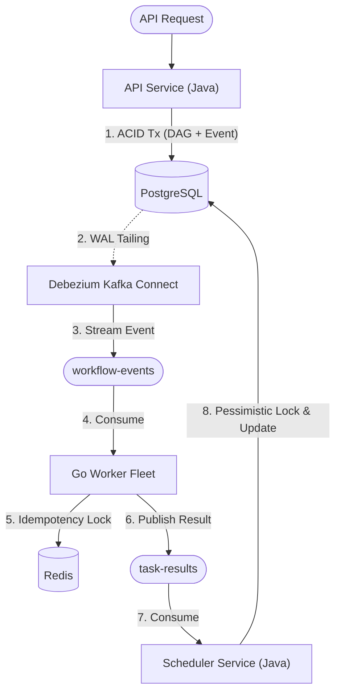

# Kairo - Distributed Workflow Orchestrator

When microservices crash, data gets lost. Kairo is an orchestrator built to ensure that if a task is scheduled, it executes exactly once, even if the entire cluster loses power.

It skips the typical database-polling loops. Instead, it relies on PostgreSQL Write-Ahead Logs (WAL), Kafka, and Redis to push state changes reliably.

## The Architecture



## System Mechanics

### 1. Zero Data Loss (The Outbox Pattern)
If you write to a database and then publish to Kafka, a crash between those two lines of code creates an inconsistent system. 
Kairo writes the workflow state and the outgoing event into Postgres in a single transaction. Debezium intercepts the raw WAL directly from the disk and streams it to Kafka. If the database transaction commits, the event is guaranteed to reach Kafka.

### 2. Idempotency (Redis Distributed Locks)
Kafka's at-least-once delivery means it will sometimes deliver the same task twice. 
Kairo's Go workers catch this by executing a `SETNX` lock against Redis. If the key exists, the worker reads the cached execution state. If the task is currently running elsewhere or already finished, the worker safely skips it.

### 3. State Concurrency
If two parallel tasks in a workflow finish at the exact same millisecond, two scheduler threads will try to transition the workflow state simultaneously.
Kairo prevents state corruption by acquiring PostgreSQL pessimistic write locks (`SELECT ... FOR UPDATE`) during the BFS traversal of the workflow graph.

## Local Environment

Requires Java 21, Go 1.24, and Docker.

```bash
# Start infrastructure
docker-compose up -d

# Register the Debezium connector
./scripts/register-debezium.sh

# Run the core services
./gradlew :api-service:bootRun
./gradlew :scheduler-service:bootRun
cd worker-service && go run main.go
```
