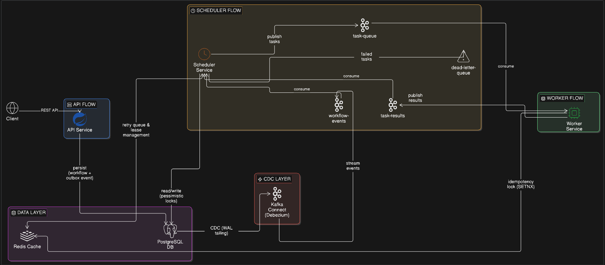
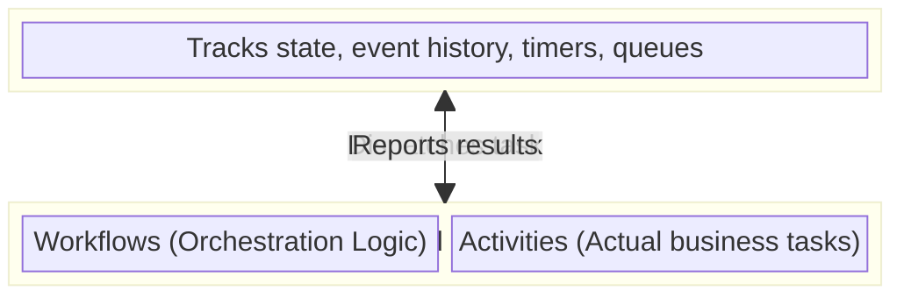

# Kairo - Distributed Workflow Orchestrator

When microservices crash, data gets lost. Kairo is an orchestrator built to ensure that if a task is scheduled, it executes exactly once, even if the entire cluster loses power.

It skips the typical database-polling loops. Instead, it relies on PostgreSQL Write-Ahead Logs (WAL), Kafka, and Redis to push state changes reliably.

## Architecture



### Conceptual Model



## System Mechanics

### 1. Zero Data Loss (The Outbox Pattern + CDC)
If you write to a database and then publish to Kafka, a crash between those two lines of code creates an inconsistent system. 
Kairo writes the workflow state and the outgoing event into Postgres in a single transaction. Debezium tails the WAL directly from disk and streams it to Kafka. If the database transaction commits, the event is guaranteed to reach Kafka.

### 2. Idempotency (Redis Distributed Locks)
Kafka's at-least-once delivery means it will sometimes deliver the same task twice. 
Kairo's Go workers catch this by executing a `SETNX` lock against Redis. If the key exists, the worker reads the cached execution state. If the task is currently running elsewhere or already finished, the worker safely skips it.

### 3. State Concurrency (Pessimistic Locking)
If two parallel tasks in a workflow finish at the exact same millisecond, two scheduler threads will try to transition the workflow state simultaneously.
Kairo prevents state corruption by acquiring PostgreSQL pessimistic write locks (`SELECT ... FOR UPDATE`) during the BFS traversal of the workflow graph.

### 4. Retry with Exponential Backoff
When a task fails, the scheduler doesn't immediately give up. It checks the retry budget, calculates an exponential delay (`2^attempt` seconds), and writes the task to a Redis Sorted Set keyed by the retry timestamp. A separate `RetryScheduler` polls Redis every second and re-enqueues due tasks. A Postgres fallback poller runs every 10 seconds in case Redis is unavailable.

### 5. DAG Validation (Kahn's Algorithm)
Before a workflow is persisted, the API validates the task dependency graph using Kahn's topological sort algorithm to detect cycles, duplicate names, and missing dependency references. Invalid DAGs are rejected at the API layer.

### 6. Dead Letter Queue
When a task exhausts its retry budget, it is published to a DLQ topic and all downstream dependents in the DAG are recursively marked as `SKIPPED` via BFS traversal.

## Local Environment

Requires Java 21, Go 1.24, and Docker.

```bash
# Start infrastructure (Postgres, Kafka, Redis, Kafka Connect, Prometheus, Grafana, Tempo)
docker-compose up -d

# Register the Debezium CDC connector
./scripts/register-debezium.sh

# Run the core services
./gradlew :api-service:bootRun
./gradlew :scheduler-service:bootRun
cd worker-service && go run main.go

# Start the interactive UI
cd kairo-ui && npm install && npm run dev
```

## Example

Submit a DAG workflow:
```bash
curl -X POST http://localhost:8080/api/v1/workflows \
  -H "Content-Type: application/json" \
  -d @test-payload.json
```

Response:
```json
{
  "id": "a1b2c3d4-...",
  "name": "E-Commerce Checkout",
  "status": "PENDING",
  "tasks": [
    { "id": "...", "name": "ValidateOrder", "status": "PENDING", "dependsOn": [] },
    { "id": "...", "name": "ChargePayment", "status": "PENDING", "dependsOn": ["ValidateOrder"] },
    { "id": "...", "name": "SendReceipt",   "status": "PENDING", "dependsOn": ["ChargePayment"] }
  ]
}
```

Query workflow status:
```bash
curl http://localhost:8080/api/v1/workflows/{id}
```

## Tech Stack

| Component | Technology |
|---|---|
| API & Scheduler | Java 21, Spring Boot 3 |
| Worker Fleet | Go 1.24 |
| Interactive UI | React, TypeScript, Vite, React Flow |
| Message Broker | Apache Kafka |
| CDC | Debezium (Kafka Connect) |
| Database | PostgreSQL 15 (WAL logical replication) |
| Distributed Lock & Retry Queue | Redis |
| Tracing | OpenTelemetry → Grafana Tempo |
| Metrics | Micrometer → Prometheus → Grafana |
